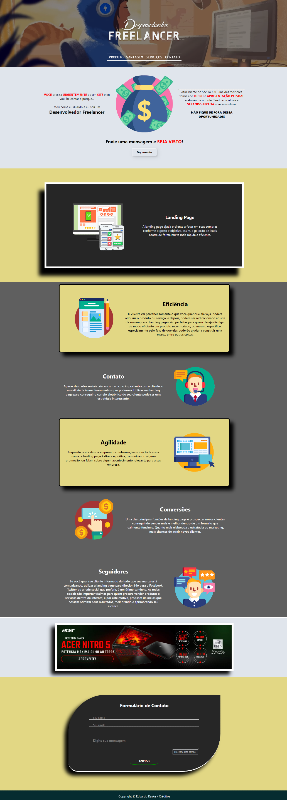

# Acesse agora o projeto online!
- Acesse <a href="https://eduardokayke.github.io/Projeto_Desenvolvedor_Freelancer/" title="Projeto no GitHub Pages">Desenvolvedor Freelancer</a> para ver o projeto online hospedado pelo GitHub Pages.

## Desenvolvedor Freelancer
O Sistema criado é original e possui [MIT License](https://github.com/EduardoKayke/Projeto_Desenvolvedor_Freelancer/blob/main/LICENSE).


### O que a aplicação faz?
Desenvolvedor Freelancer é um site. Objetivo de oferecer os serviços de desenvolvimento web e freelancer com formulário para contato. A aplicação está 100% responsiva.

__OBS: Existem muitos efeitos ao passar o mouse nas funcionalidades do site. As fotos abaixo não mostram os efeitos por completo.__
    
### Ferramentas utilizadas.
- __HTML__
- __CSS__

### Como rodar a aplicação?
- Clone esse repositório usando o comando abaixo:
    ```code
    https://github.com/EduardoKayke/Projeto_Desenvolvedor_Freelancer.git
    ```
- Ou realize o download do repositório clicando [aqui](https://github.com/EduardoKayke/Projeto_Desenvolvedor_Freelancer/archive/refs/heads/main.zip).
- Inicialize o arquivo index.html clicando duas vezes. O site vai abrir no navegador.
- Pronto, a aplicação está rodando!

## Imagens do Projeto

